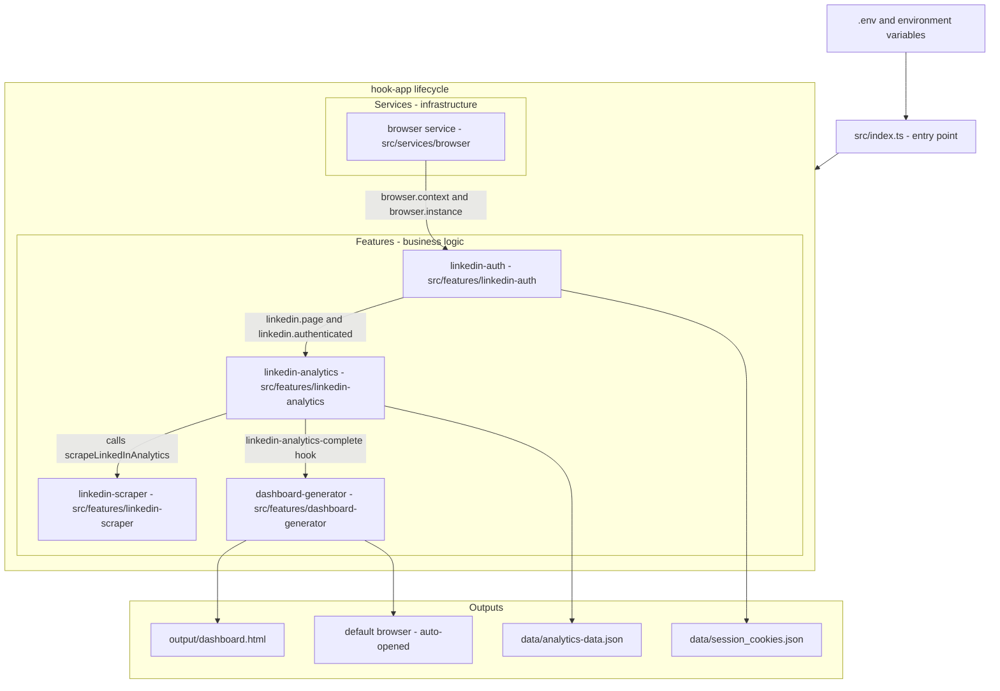
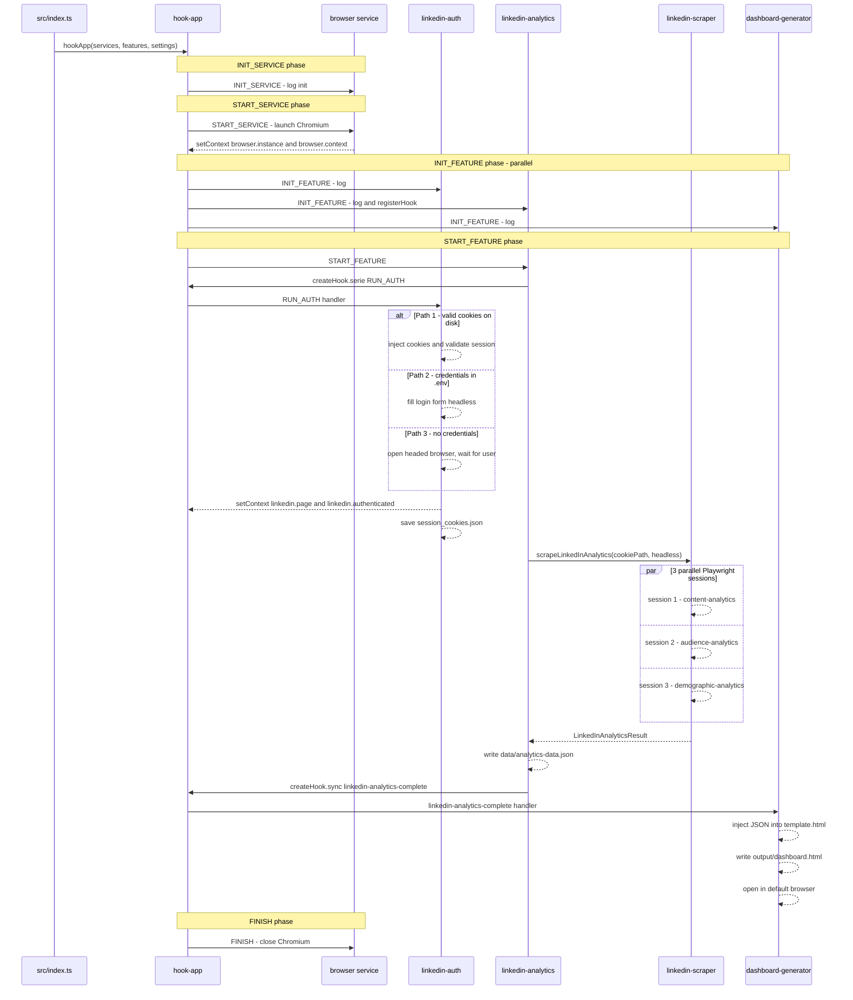

# Architecture

## Overview

`linkedin-stats` is a TypeScript Node.js application built on the **hook-app framework**. It scrapes LinkedIn Creator analytics in parallel using Playwright, persists the results as JSON, and renders a self-contained Chart.js dashboard.

The entire codebase follows hook-app's event-driven, plugin-style architecture: one **service** provides shared browser infrastructure, four **features** handle all business logic, and they communicate exclusively through hooks and shared context — never via direct imports between features.

---

## System flow diagram



---

## Lifecycle sequence

hook-app runs each phase before moving to the next. Services always initialise before features.



---

## Module map

### `src/index.ts` — entry point

The **only** file that reads `process.env`. Passes all config as settings into `hookApp()`. Registers the browser service and all four features.

### `src/services/browser/` — Browser service

| Hook | Action |
|---|---|
| `$INIT_SERVICE` | Logs initialisation |
| `$START_SERVICE` | Launches Chromium with anti-detection args; stores `browser.instance`, `browser.context`, `browser.headless` in context |
| `$FINISH` | Closes the browser cleanly |

### `src/features/linkedin-auth/` — Authentication

Handles the `$RUN_AUTH` custom hook (triggered by `linkedin-analytics`). Implements three fallback paths:

| Path | Trigger | Mechanism |
|---|---|---|
| Cookie restore | `session_cookies.json` exists | `browserContext.addCookies()` → navigate to `/feed/` to validate |
| Credential login | `LINKEDIN_USERNAME` + `LINKEDIN_PASSWORD` set | Fill login form headlessly; security challenge → headed fallback |
| Manual headed login | No credentials | Close headless browser, relaunch headed, wait for user |

Saves the full Playwright `Cookie[]` array to disk after any successful login.

### `src/features/linkedin-analytics/` — Orchestrator

Runs on `$START_FEATURE`:
1. Fires `$RUN_AUTH` (sequential via `createHook.serie`)
2. Calls `scrapeLinkedInAnalytics()` from the scraper feature
3. Writes `data/analytics-data.json`
4. Emits `linkedin-analytics-complete` so the dashboard generator picks it up

Also registers the `linkedin-analytics-complete` custom hook so hook-app knows about it.

### `src/features/linkedin-scraper/` — Parallel scraper

Pure functions — no hook registrations. Called directly by `linkedin-analytics`.

Uses `Promise.allSettled` to run three fully independent Playwright sessions simultaneously. A failure in one scraper does not abort the others; errors are collected in `result.errors`.

| File | Responsibility |
|---|---|
| `index.ts` | `scrapeLinkedInAnalytics()` — orchestrates the three sessions |
| `content-analytics.ts` | Impressions, engagements, engagement rate |
| `audience-analytics.ts` | Follower growth, lifetime follower count |
| `demographic-analytics.ts` | Industries, job titles, seniorities, functions, locations |
| `auth.ts` | `loadCookies()` / `injectCookies()` — per-session cookie injection |
| `browser.ts` | `createBrowserSession()` — standalone session factory |
| `types.ts` | All shared TypeScript interfaces |

### `src/features/dashboard-generator/` — Dashboard

Listens on `linkedin-analytics-complete`. Reads `template.html`, replaces the `__ANALYTICS_DATA__` placeholder with the serialised JSON, writes `output/dashboard.html`, then calls `open()` to launch it in the default browser.

---

## Context keys

All shared state lives in hook-app context (a typed key-value store). Features never import each other's internals.

| Key | Type | Set by | Read by |
|---|---|---|---|
| `browser.instance` | `Browser` | browser service | linkedin-auth (to replace with headed on manual login) |
| `browser.context` | `BrowserContext` | browser service | linkedin-auth (Path 1, 2) |
| `browser.headless` | `boolean` | browser service | — |
| `linkedin.page` | `Page` | linkedin-auth | (available for future use) |
| `linkedin.authenticated` | `boolean` | linkedin-auth | (available for future use) |

---

## Data types

```
LinkedInAnalyticsResult
├── content: ContentAnalytics | null
│   ├── impressions: DailyMetric[]      { date, value }
│   ├── engagements: DailyMetric[]
│   ├── totalImpressions: number
│   ├── totalEngagements: number
│   ├── engagementRate: number
│   └── capturedAt: string
├── audience: AudienceAnalytics | null
│   ├── followerGrowth: DailyMetric[]
│   ├── lifetimeFollowerCount: number
│   └── capturedAt: string
├── demographics: DemographicAnalytics | null
│   ├── industries: DemographicEntry[]  { label, count, percentage }
│   ├── jobTitles: DemographicEntry[]
│   ├── locations: DemographicEntry[]
│   ├── functions: DemographicEntry[]
│   ├── seniorities: DemographicEntry[]
│   └── capturedAt: string
├── scrapedAt: string                   ISO timestamp
└── errors: string[]                    per-scraper error messages
```

---

## Design rules

- **`process.env` only in `src/index.ts`** — everything else uses `getConfig()`
- **No direct imports between features** — communication via hooks and context only
- **No `any`, no `@ts-ignore`, no non-null assertions (`!`)**
- **`.js` extensions on all relative imports** (ESM compatibility)
- **`$INIT_*` hooks are sync-only** — async work goes in `$START_*`
- **pnpm only** — never npm or yarn
